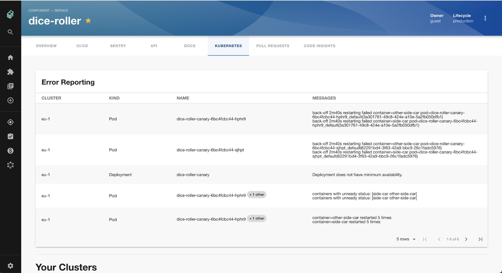
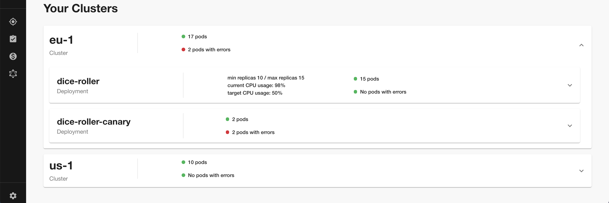
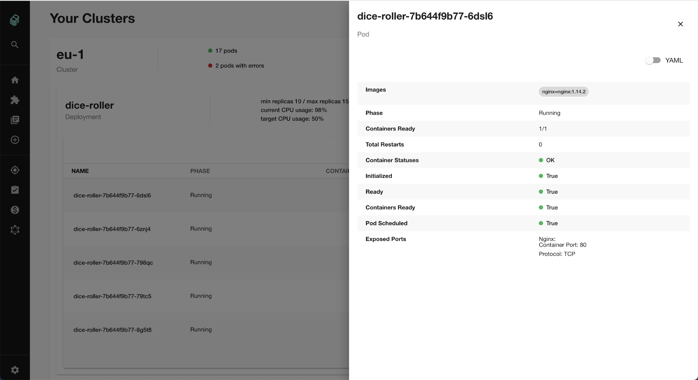

---
# prettier-ignore
title: "New Backstage feature: Kubernetes for Service owners"
author: Matthew Clarke, Spotify
authorURL: https://github.com/mclarke47
---

TLDR; We’re rethinking the Kubernetes developer experience with a new feature: a Kubernetes monitoring tool that’s designed around the needs of service owners, not cluster admins. Now developers can easily check the health of their services no matter how or where those services are deployed — whether it’s on a local host for testing or in production on dozens of clusters around the world.

And since Backstage uses the native Kubernetes API, the feature works with whichever cloud provider (AWS, Azure, GCP, etc.) or managed service (OpenShift, IBM Cloud, GKE, etc.) you already use.

<!--truncate-->

## The missing link between K8s and your service

A core feature of Backstage is its service catalog, which aggregates information about software systems together inside a single tool, with a consistent, familiar UI.

By navigating to a service’s overview page in Backstage, you can see everything you need to know about the service: what it does, its APIs and technical documentation, CI/CD progress — and now detailed information about its presence on Kubernetes clusters.

## No more context switching

Kubernetes in Backstage can be configured to search multiple clusters for your services. It will then aggregate them together into a single view. So if you deploy to multiple clusters you will no longer need to switch kubectl contexts to understand the current state of your service.

## Automatic error reporting

Instead of trying different kubectl commands to figure out where an error occurred, Backstage will automatically find and highlight errors in Kubernetes resources that are affecting your service. So you can spend time fixing errors, not hunting for them.

## Autoscaling limits at a glance

Backstage also shows you how close your service is to its autoscaling limit. Coming up to a period of high load? Now you will be able to see how your horizontal autoscaling is dealing with it across multiple clusters.

## Pick a cloud, any Cloud

Since Backstage communicates directly with the Kubernetes API, it’s cloud agnostic — it doesn’t matter how or where you’re running Kubernetes. You’ll always get the same familiar view of your deployments, whether you’re:

- Deploying to clusters on AWS, Azure, GCP, or another cloud provider
- Using an unmanaged or managed Kubernetes service (like OpenShift, etc.)
- Migrating from one cloud provider or service to another
- Testing on a single local machine or deploying to a dozen clusters in production

In short: local or global, single or multi-cloud, managed or unmanaged — Backstage always provides a seamless Kubernetes experience for your service owners’ day-to-day development needs.

## Rethinking the developer experience

The philosophy behind Backstage is simple: improve developer experience by reducing infrastructure complexity. As popular and widespread as Kubernetes has become, all of the tools to date have been geared toward the needs of cluster admins. These tools add unnecessary complexity to the workflows of the typical developer building, testing, and deploying services.

We believe Backstage Kubernetes gives developers back control of their services by providing a more focused and consistent experience. Backstage provides a single standard for developers to monitor their Kubernetes deployments, regardless of the underlying cloud infrastructure.

## Future iterations

The current focus of Kubernetes in Backstage is Deployments/ReplicaSets/Pods — but we know that not everyone utilizes these.

As we continue to grow and develop Kubernetes in Backstage with the community, we hope to offer support for Kubernetes resources beyond Deployments and Custom Resource Definitions. You can browse or add open issues for the plugin [here].

## Getting started

We made the Kubernetes plugin a core feature of Backstage. Like Software Templates (scaffolder) and TechDocs, the k8s-plugin is installed with the core app. When you update the app to the latest version and go to the Kubernetes tab of any service, you will be asked to provide your cloud provider credentials. To learn more, including details on configuration and surfacing your Kubernetes components as part of an entity, [read the docs].

To contribute or get more information on Kubernetes in Backstage, [join the discussion on Discord]!

[here]: https://github.com/backstage/backstage/issues?q=is%3Aissue+is%3Aopen+kubernetes+label%3Ak8s-plugin
[read the docs]: https://backstage.io/docs/features/kubernetes/overview
[join the discussion on discord]: https://discord.gg/backstage-687207715902193673
